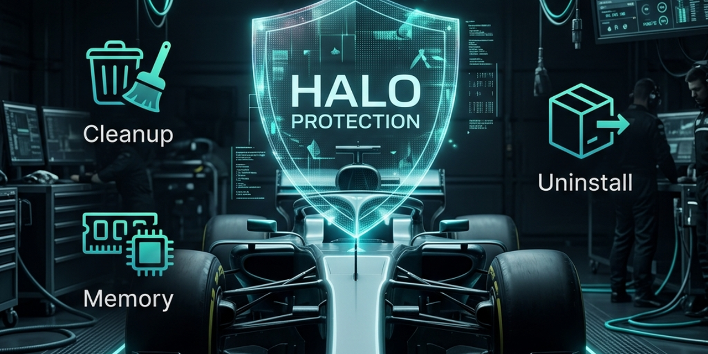
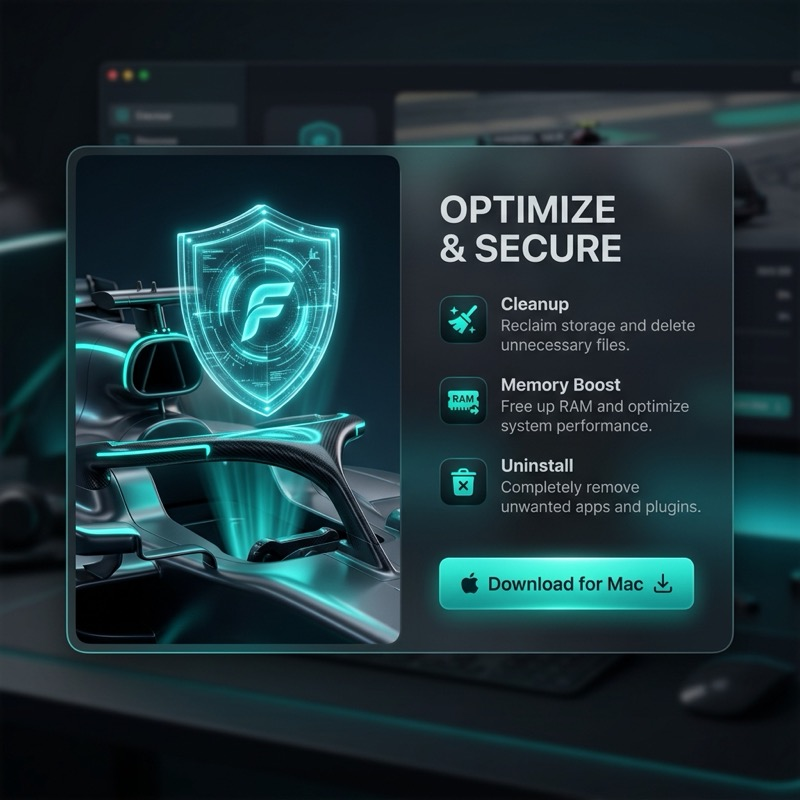

<p align="center">
  
</p>

<p align="center">
  <strong>Your Mac. Elevated.</strong><br/>
  A native macOS system utility — cleanup, protection, performance, clipboard history &amp; live widget.<br/><br/>
  
  
  
  
  
  
</p>

---

<p align="center">
  
</p>

---

## What Halo is

Halo is a single app that answers the questions you'd otherwise open five different
tools to answer: **What's slowing my Mac down? What's eating my disk? What can I
safely delete? What has permission to watch me?**

Everything it reports is real, measured data. Where macOS won't let an app see
something, Halo says so plainly instead of showing a guess or a zero — you'll see
"Not available on this drive" or "Needs Full Disk Access", never a made-up number.

**Nothing is ever deleted permanently.** Every removal goes to the Trash, and every
one asks you first.

---

## Install

1. Download the `.dmg` from the [latest release](https://github.com/prasad-rently/halo-mac/releases) and open it.
2. Drag **Halo** into your **Applications** folder.
3. **First launch: right-click Halo → Open**, then click Open again.

That third step matters. This build is signed with a personal development
certificate rather than a paid Apple Developer ID, so macOS doesn't recognise it
and a normal double-click will refuse to run it. Right-click → Open tells macOS you
trust it. You only do this once.

If macOS still blocks it, run this once in Terminal:

```bash
xattr -dr com.apple.quarantine /Applications/Halo.app
```

**Needs macOS 13 (Ventura) or newer.**

### Permissions it will ask for

Halo asks for these the first time a feature needs them. Everything works without
them except the specific feature named — nothing is silently disabled.

| Permission | What stops working without it |
|---|---|
| **Accessibility** | The global shortcuts (⌘⇧V clipboard, ⌘⇧A actions) won't open from other apps |
| **Full Disk Access** | The per-app permission list in Protection stays empty |
| **Notifications** | You won't get alerts when a scan finds something |

---

## What's inside

Halo has twelve sections down the left-hand side. You can drag them into whatever
order you like — click the slider icon at the top of the sidebar.

### Dashboard

Your Mac at a glance. A **health score out of 100** built from how hard the CPU is
working, how much memory is under pressure, how full the disk is, and how worn the
battery is. Below it: live CPU, memory, disk, network and battery cards, and a
graph of how the score has moved over the past week.

Also here:

- **Smart Scan** — one button that audits the whole system in the background.
- **Focus Session** — pick a length, and Halo hides the apps you've listed as
  distractions for that long, then tells you what your Mac was doing while you
  worked. It never quits an app, only hides it, and everything comes back when the
  session ends.
- **App usage** — which apps you actually spend your day in, and which ones sit in
  the background doing nothing useful. Off by default; turn it on in Settings.
- **Backup status** — when Time Machine last ran and whether it worked.
- **Weekly digest** — an optional summary notification once a week.
- **Alert history** — the last 50 things Halo told you about.
- **Export Report** — a 4-page PDF of your Mac's health you can save or send.

### Cleanup

Finds space you can get back: system and app caches, old logs, temporary files,
Xcode build leftovers, old iOS backups, unused language files, and the Trash.
There's also a **Browsers** tab that clears cache, history, cookies and saved
sessions per browser and per category, so you can dump 8 GB of Chrome cache
without losing your logins.

Everything is listed with its real size, nothing is pre-selected without you
seeing it, and **Clean Selected** moves files to the Trash.

### Protection

Four things, all read-only — Protection never changes anything on its own:

- **Malware scan** — checks for known adware, unwanted programs, browser hijackers
  and keyloggers against a bundled list of definitions that updates itself.
- **Security checklist** — is FileVault on? Gatekeeper? The firewall? Automatic
  updates? Four of the eight checks are read automatically; the other four have no
  reliable way to be read by an app, so Halo tells you to check them yourself
  rather than guessing.
- **Exposed secrets** — scans your Downloads, Documents and Desktop for things that
  shouldn't be sitting in a plain file: card numbers, AWS and GitHub keys, SSH
  private keys. Matches are always shown **partly hidden** (`sk_live_••••••••3f2a`),
  never in full, and Halo can only show you where they are — it can't delete them.
- **App permissions** — which apps hold Screen Recording, Accessibility, camera or
  microphone access, with the surprising ones flagged. Needs Full Disk Access.

### Performance

What's using your Mac right now: per-core CPU, real memory pressure, top processes
by CPU or memory, network throughput, battery health and cycle count, and
temperature sensors where the Mac exposes them.

Also:

- **Login items** — everything set to start when you log in, including the
  background agents apps install without telling you.
- **Memory trends** — watches apps over time and flags one whose memory only ever
  goes up, which usually means a leak. You can restart the app from here.
- **Network activity** — which apps are talking to the internet and how much data
  they've moved. Hostnames are best-effort: macOS doesn't let an app see the name a
  process asked for, so an address that won't resolve is left blank rather than
  guessed at.
- **Idle apps** — apps you left running and forgot about.

### Applications

Every app you have installed, with its size and when you last opened it.
**Uninstall** removes the app *and* the files it scattered across twelve standard
Library folders — preferences, caches, containers, saved state, and the rest. You
see the full list and confirm before anything moves.

If Halo can't tell when an app was last used, it says so rather than calling it
unused.

### Files

Seven tabs:

| Tab | What it's for |
|---|---|
| **Space Lens** | A visual map of what's filling your disk. Click to drill in. |
| **Exact Duplicates** | Byte-for-byte identical files. Keeps the best copy, marks the rest. |
| **Similar Photos** | Photos that *look* the same — a re-export, a crop, a screenshot of a screenshot. Keeps the highest-resolution one. |
| **Large Files** | Everything oversized, biggest first. |
| **Downloads** | Your Downloads folder, sorted so the junk is obvious. |
| **Drive Speed** | A real read/write speed test for internal and external drives, plus **Drive Health** — your SSD's wear level, temperature and error counts. |
| **iCloud Drive** | What your iCloud files take up *on this Mac*, and which are downloaded versus still in the cloud. |

### Clipboard

Everything you copy, kept and searchable — text, links, code, images and colours.
Pin the ones you use constantly. Press **⌘⇧V** in any app to bring up a floating
picker and click to paste.

### Actions

Over a hundred one-click fixes for things that normally mean looking up a Terminal
command: clear Xcode's derived data, remove `node_modules`, flush the DNS cache,
restart the Dock, convert HEIC photos to JPEG, format the JSON on your clipboard,
show your Wi-Fi password.

Press **⌘⇧A** anywhere to search them by name. You can add your own, and anything
needing an administrator password asks for it the normal macOS way.

### HaloShare

Send files to another Mac on the same network, without the cloud.

### Ports

Which programs are listening on which network ports — the answer to "something is
already using port 3000". You can name ports you care about, and stop a process
from here.

### AI Assistant

A chat panel that can answer questions about your Mac and run Halo's own actions
for you. **Bring your own API key** (Claude, OpenAI or Gemini) — Halo has no
built-in key and sends nothing anywhere until you add one.

### Menu Bar

A live indicator next to the clock. Five styles, in Settings → Menu Bar:

- **Icon** — just the Halo icon
- **Text** — `CPU 42% · RAM 61%`
- **Mini bars** — two tiny progress bars
- **Dot** — green, amber or red depending on how hard your Mac is working
- **Custom** — write your own using tokens like `{cpu}`, `{ram}`, `{battery}`,
  `{net_down}`, with a live preview as you type

During a Focus Session it automatically shows the countdown instead, then goes
back to your choice.

---

## A few other things

### Desktop widget

Right-click your desktop → **Edit Widgets** → search **Halo Monitor**.

| Size | Shows |
|---|---|
| Small | CPU and memory |
| Medium | CPU and memory, plus network up/down |
| Large | Both of the above, plus your five most recent clipboard items |

It refreshes about once a minute. That's a limit macOS imposes on all widgets, not
a Halo setting.

### Scans on a schedule

**Settings → Scheduled Scans** — daily, weekly or monthly, on the day and hour you
pick. The next run is shown on the Dashboard. Halo runs these when your Mac is idle
so you don't notice them.

### Ask Siri

Eight questions work out of the box, and all of them are available in the Shortcuts
app for your own automations:

> "Hey Siri, what's my Mac's health score?" · CPU usage · battery health · disk
> space · run a Smart Scan · run a Halo action · recent clipboard items · export a
> health report

---

## Requirements

| | |
|---|---|
| **To use Halo** | macOS 13 Ventura or newer |
| To build it yourself | Xcode 15.4+, Swift 5.9 |
| To sign it yourself | Any Apple Development certificate (a paid account is only needed for notarised distribution) |

---

## For developers

### Build and run

```bash
git clone https://github.com/prasad-rently/halo-mac.git
cd halo-mac
open Halo.xcodeproj
```

Set your own Team on the **Halo**, **HaloWidget** and **HaloHelper** targets
(Signing & Capabilities), then run. The App Group `group.com.halo.mac` must exist
on all three or the widget will show no data.

Run the tests with the **HaloTests** scheme (⌘U), or:

```bash
xcodebuild -project Halo.xcodeproj -scheme HaloTests -configuration Debug \
  -derivedDataPath /tmp/HaloBuild \
  CODE_SIGNING_REQUIRED=NO CODE_SIGNING_ALLOWED=NO CODE_SIGN_IDENTITY="" \
  test
```

There is also an audit that keeps subprocess handling in one place:

```bash
./scripts/audit-subprocess-spawning.sh
```

### Building a distributable app

> **There is no `Halo` scheme** — only `HaloTests`, `HaloUITests`, `HaloWidget` and
> `HaloHelper`. Build the **target** instead. And `-derivedDataPath` requires a
> scheme, so set `SYMROOT`/`OBJROOT` directly.

> **Build into a clean `SYMROOT`.** One previously used for a test build leaves
> `HaloTests.xctest` and the XCTest frameworks *inside* `Halo.app`. They would
> ship, and they break signing one component at a time.

```bash
# 1. Build (signing off here so xcodebuild doesn't demand a provisioning profile)
rm -rf /tmp/HaloBuild/Build/Products
xcodebuild -project Halo.xcodeproj \
  -target Halo -configuration Debug \
  SYMROOT=/tmp/HaloBuild/Build/Products \
  OBJROOT=/tmp/HaloBuild/Build/Intermediates.noindex \
  CODE_SIGNING_REQUIRED=NO CODE_SIGNING_ALLOWED=NO CODE_SIGN_IDENTITY="" \
  build

APP="/tmp/HaloBuild/Build/Products/Debug/Halo.app"

# Find your signing identity rather than hardcoding one
CERT=$(security find-identity -v -p codesigning \
        | sed -n 's/.*"\(Apple Development:.*\)"/\1/p' | head -1)
[ -n "$CERT" ] || { echo "no codesigning identity found"; exit 1; }

# 2. Sign inside-out. Every nested piece must be signed before its container,
#    or the outer signature fails with "In subcomponent: ...".
find "$APP" -name "*.dylib" | while read d; do
  codesign --force --sign "$CERT" --timestamp=none "$d"
done
if [ -d "$APP/Contents/Frameworks/Sentry.framework" ]; then
  codesign --force --sign "$CERT" --timestamp=none \
    "$APP/Contents/Frameworks/Sentry.framework"
fi
codesign --force --sign "$CERT" \
  --entitlements HaloHelper/HaloHelper.entitlements --timestamp=none \
  "$APP/Contents/XPCServices/HaloHelper.xpc"
codesign --force --sign "$CERT" \
  --entitlements HaloWidget/HaloWidget.entitlements --timestamp=none \
  "$APP/Contents/PlugIns/HaloWidget.appex"
codesign --force --sign "$CERT" \
  --entitlements Halo/Halo-Debug.entitlements --timestamp=none "$APP"

# 3. Install and register the widget
cp -R "$APP" ~/Applications/Halo.app
pluginkit -a ~/Applications/Halo.app/Contents/PlugIns/HaloWidget.appex

# 4. Verify
codesign --verify --deep --strict ~/Applications/Halo.app && echo "OK"
```

**Why `Halo-Debug.entitlements` for a distributed build?** It turns the App
Sandbox *off*. The sandbox blocks `posix_spawn`, and several features read the
system by running Apple's own command-line tools (`diskutil`, `lsof`, `tmutil`,
`fdesetup`). Sandboxed, those features can't ask the question and honestly report
that they couldn't — which is correct behaviour, but not useful. `Halo.entitlements`
(sandbox on) exists for a future App Store submission.

### Project layout

```
Halo/            main app — App/, Core/, Core/Scanner/, Features/, Intents/, DesignSystem/
HaloWidget/      widget extension
HaloHelper/      XPC helper for privileged operations
Shared/          code compiled into both the app and the widget
HaloTests/       unit tests   ·   HaloUITests/  UI tests
scripts/         repo audits
docs/            architecture, design system, roadmaps, code reviews
```

[`CLAUDE.md`](CLAUDE.md) is the detailed engineering reference — every module, the
patterns to follow, and a long list of hard-won gotchas. **Read it before changing
anything.**

---

## Key Technical Decisions

### No permanent deletion
All file removal uses `FileManager.trashItem(at:resultingItemURL:)`. The user always has a Trash safety net.

### Dual entitlements
- `Halo-Debug.entitlements` — sandbox **off**. Required both so `NSEvent.addGlobalMonitorForEvents` (the ⌘⇧V / ⌘⇧A hooks) works without an XPC helper, and so the features that read the system via Apple's command-line tools can spawn them at all. This is the configuration shipped in releases.
- `Halo.entitlements` — sandbox **on** with temporary path exceptions, for a future App Store submission.

### Widget data pipeline
```
SystemMonitor (every 2 s)
  └─► AppState.writeWidgetData()
        └─► UserDefaults(suiteName: "group.com.halo.mac")  ← shared container
              └─► HaloProvider.getTimeline()  (every 60 s)
                    └─► WidgetKit renders updated view
```
`reloadAllTimelines()` is called once per minute (not every 2 s) to stay within macOS's reload budget (~40–70 reloads/hour).

### Swift Concurrency
- Every scanner is an `actor` — `FileSystemScanner`, `DuplicateDetector`, `SignatureDatabase`, `LoginItemScanner`, `AppScanner`, `PerceptualDuplicateDetector`, `SMARTDiskMonitor`, `NetworkTrafficMonitor`, `PrivacyExposureScanner` and the rest — so all I/O is off the main thread.
- All ViewModels are `@MainActor final class … ObservableObject`.
- `ScanCoordinator` uses `withTaskGroup` for parallel category scanning.

### Spawning subprocesses
Several features read the system by running Apple's own command-line tools. All of
it goes through `ShellReader`, which drains stdout and stderr concurrently and
bounds every call — an undrained pipe or a missing deadline hangs the caller
permanently, and both had shipped before it was extracted. The only sanctioned
exception is `ActionRunner`, which streams output to the UI line by line and so
cannot use a batch reader. See gotcha 20 in `CLAUDE.md`.

`scripts/audit-subprocess-spawning.sh` enforces this — a rule in a document
already failed to prevent it once, when five scanners each grew their own
unbounded `Process`.

### Sentry Crash Reporting
- Opt-in only (`enableAnalytics` UserDefaults key, defaults to `false`)
- DSN read from `Info.plist` — never hardcoded in source
- `sendDefaultPii = false` — no user data ever sent

---

## Design Tokens (quick reference)

| Token | Hex | Usage |
|-------|-----|-------|
| Background | `#080c14` | Window / widget background |
| Surface | `#0d1220` | Cards, panels |
| Surface2 | `#131928` | Nested containers |
| Accent | `#4f7cff` | Primary actions, links |
| Accent2 | `#7b5ea7` | Gradient pair for Accent |
| Green | `#22d97a` | Success, healthy state |
| Amber | `#f5a623` | Warning, medium load |
| Red | `#ff4d6a` | Error, critical load |
| Cyan | `#00d4e8` | URL clipboard items |
| Purple | `#b06cff` | Code clipboard items |

All tokens live in `DesignSystem/DesignSystem.swift` as `Color` extensions (e.g., `.haloAccent`, `.haloGreen`).

---

## Roadmap

See [`docs/ROADMAP.md`](docs/ROADMAP.md) and [`docs/FEATURE_ROADMAP.md`](docs/FEATURE_ROADMAP.md) for full status.

Known gaps in the current build:
1. **Not notarised** — needs a paid Apple Developer ID. Hence right-click → Open on first launch.
2. **Sentry DSN** — `Info.plist` still holds `SENTRY_DSN_PLACEHOLDER`, so crash reporting is inert. (It's opt-in and off by default regardless.)
3. **No CI** — tests and the audit script are run by hand.
4. **Swift 6 language mode** — a number of concurrency warnings are errors under it; migration is its own piece of work.
5. **App Store submission** — would need the sandboxed entitlements, which disable the features that shell out.

---

## Contributing

Contributions are welcome! Please open an issue first to discuss what you'd like to change. Pull requests should target the `main` branch.

Please read [`CLAUDE.md`](CLAUDE.md) first — it documents the patterns this codebase relies on and the mistakes already made and fixed.

1. Fork the repo
2. Create a feature branch (`git checkout -b feat/my-feature`)
3. Commit your changes following the existing code style
4. Open a Pull Request

---

## License

Released under the [MIT License](LICENSE).

Copyright © 2026 [Prasad](https://github.com/prasad-rently)
