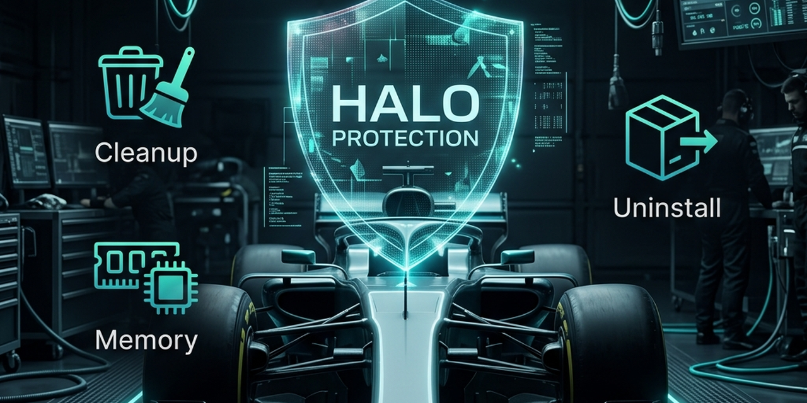
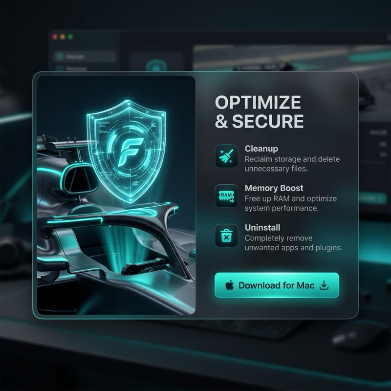

<p align="center">
  
</p>

<p align="center">
  <strong>Your Mac. Elevated.</strong><br/>
  A native macOS system utility — cleanup, protection, performance, clipboard history &amp; live widget.<br/><br/>
  <a href="https://github.com/prasad-rently/halo-mac/actions/workflows/ci.yml"></a>
  
  
  
  
  
  
</p>

---

<p align="center">
  
</p>

---

## Features at a Glance

| Module | What it does |
|--------|-------------|
| **Dashboard** | Live health score ring, CPU/RAM/disk/network/battery cards, Smart Scan trigger, alert history, PDF report export |
| **Cleanup** | Scans caches, logs, temp files, Xcode derived data, iOS backups, language packs, trash |
| **Protection** | Real malware/adware/PUP/hijacker/keylogger detection via bundled + auto-updated signature database |
| **Performance** | Login-item manager (real plist enumeration), RAM/DNS/permission maintenance tasks |
| **Applications** | Installed app inventory with deep-uninstall leftovers detection across 12 standard paths |
| **Files** | SpaceLens treemap, SHA-256 duplicate finder, large-file browser |
| **Clipboard** | Full clipboard history (text, URL, code, image, color), ⌘⇧V quick-picker overlay |
| **Menu Bar** | Persistent indicator with 4 display styles: icon, text stats, mini progress bars, or coloured dot |
| **Widget** | macOS Notification Center widget — Small/Medium/Large, updates every 60 s |
| **Alert History** | Persistent in-app alert log (50 entries, unread badge, tap-to-dismiss) |
| **Report Export** | 4-page PDF system health report: cover, metrics, storage/battery, alert history |
| **Scheduled Scan** | Custom day + hour schedule for automatic background Smart Scans |

---

## Requirements

| Requirement | Version |
|-------------|---------|
| macOS | 13.0 Ventura or later |
| Xcode | 15.4 or later |
| Swift | 5.9 |
| Apple Developer account | Required for App Group entitlements & signing |

---

## Project Structure

```
Halo/
├── Halo.xcodeproj/
│   └── project.pbxproj           ← single source of truth for all targets
├── Halo/                         ← Main app target (com.halo.mac)
│   ├── App/
│   │   ├── HaloApp.swift         ← @main, Sentry init, SignatureDatabase load, ScanScheduler start
│   │   ├── AppState.swift        ← @MainActor ObservableObject, central store
│   │   └── ContentView.swift     ← NavigationSplitView + sidebar routing
│   ├── Core/
│   │   ├── Models/Models.swift   ← All data models
│   │   ├── HotkeyManager.swift   ← Global NSEvent monitor for ⌘⇧V
│   │   ├── AlertLog.swift        ← @MainActor singleton, 50-item alert history
│   │   ├── AlertManager.swift    ← UNUserNotification + AlertLog bridge
│   │   ├── ReportGenerator.swift ← PDFKit 4-page PDF export
│   │   ├── ScanScheduler.swift   ← NSBackgroundActivityScheduler wrapper
│   │   └── Scanner/
│   │       ├── SystemMonitor.swift      ← CPU/RAM/disk/battery/network via IOKit
│   │       ├── FileSystemScanner.swift  ← async actor, AsyncStream events
│   │       ├── ScanCoordinator.swift    ← orchestrates Smart Scan pipeline
│   │       ├── DuplicateDetector.swift  ← SHA-256 3-phase detection
│   │       ├── ClipboardMonitor.swift   ← NSPasteboard polling
│   │       ├── SignatureDatabase.swift  ← actor; bundled + HTTPS-updated definitions
│   │       ├── ProtectionScanner.swift  ← async; threat detection via SignatureDatabase
│   │       ├── LoginItemScanner.swift   ← actor; LaunchAgent/Daemon plist enumeration
│   │       └── AppScanner.swift         ← actor; installed apps + leftover detection
│   ├── DesignSystem/
│   │   └── DesignSystem.swift    ← Colors, HaloCard, buttons, typography tokens
│   ├── Features/
│   │   ├── Dashboard/DashboardView.swift
│   │   ├── Cleanup/CleanupView.swift
│   │   ├── Protection/ProtectionView.swift
│   │   ├── Performance/PerformanceView.swift
│   │   ├── Applications/ApplicationsView.swift
│   │   ├── Files/FilesView.swift
│   │   ├── Clipboard/
│   │   │   ├── ClipboardView.swift
│   │   │   ├── ClipboardMonitor.swift
│   │   │   └── ClipboardQuickPickerView.swift
│   │   ├── MenuBar/MenuBarView.swift
│   │   ├── SmartScan/SmartScanView.swift
│   │   └── Onboarding/OnboardingView.swift
│   └── Resources/
│       ├── Info.plist
│       ├── PrivacyInfo.xcprivacy
│       ├── signatures.json            ← 45 bundled malware signatures
│       ├── Halo.entitlements          ← Release / App Store (sandboxed)
│       └── Halo-Debug.entitlements    ← Debug (no sandbox, AX monitor works)
├── HaloWidget/                   ← Widget extension target (com.halo.mac.widget)
│   ├── HaloWidget.swift          ← Timeline provider + all 3 size views
│   ├── HaloWidgetBundle.swift    ← @main WidgetBundle
│   ├── Info.plist
│   └── HaloWidget.entitlements
├── Shared/
│   └── HaloSharedData.swift      ← Codable struct shared by both targets via App Group
├── HaloTests/
│   └── HaloTests.swift           ← Swift Testing suite (DuplicateDetector, Clipboard)
├── Package.swift                 ← SPM (Sentry 8.x dependency)
├── CLAUDE.md                     ← AI agent memory / architecture decisions
└── docs/
    ├── ARCHITECTURE.md           ← Data flow, concurrency, key design decisions
    ├── WIDGET.md                 ← Widget implementation guide
    ├── DESIGN_SYSTEM.md          ← All design tokens and reusable components
    ├── ROADMAP.md                ← Feature status and future plans
    └── FEATURE_ROADMAP.md        ← Detailed feature iteration pipeline
```

---

## Getting Started

### 1. Clone and open

```bash
git clone <repo-url>
cd Halo
open Halo.xcodeproj
```

### 2. Set your Team

In Xcode: select the **Halo** project → **Signing & Capabilities** → set your **Team** for both the `Halo` and `HaloWidget` targets. Ensure both use the same **App Group**: `group.com.halo.mac`.

### 3. Build & Run

Select the **Halo** scheme → ⌘R. The app targets **macOS 13.0+**.

### 4. Grant permissions (first launch)

Halo's onboarding flow requests:
- **Full Disk Access** — required for deep cleanup scans (System Settings → Privacy)
- **Accessibility** — required for the global ⌘⇧V clipboard hotkey
- **Notifications** — required for threat and scan completion alerts

### 5. Run tests

```bash
xcodebuild test -project Halo.xcodeproj -scheme HaloTests
```

---

## Building for Distribution (command-line)

```bash
# Build without code signing
xcodebuild -project Halo.xcodeproj \
  -scheme Halo \
  -configuration Debug \
  -derivedDataPath /tmp/HaloBuild \
  CODE_SIGNING_REQUIRED=NO \
  CODE_SIGNING_ALLOWED=NO \
  CODE_SIGN_IDENTITY="" \
  build

APP="/tmp/HaloBuild/Build/Products/Debug/Halo.app"
CERT="Apple Development: Your Name (XXXXXXXXXX)"

# Sign dylibs first, then Sentry.framework, then the widget extension, then the outer app
find "$APP" -name "*.dylib" | while read d; do
  codesign --force --sign "$CERT" --timestamp=none "$d"
done
if [ -d "$APP/Contents/Frameworks/Sentry.framework" ]; then
  codesign --force --sign "$CERT" --timestamp=none \
    "$APP/Contents/Frameworks/Sentry.framework"
fi
codesign --force --sign "$CERT" \
  --entitlements HaloWidget/HaloWidget.entitlements \
  --timestamp=none "$APP/Contents/PlugIns/HaloWidget.appex"
codesign --force --sign "$CERT" \
  --entitlements Halo/Halo-Debug.entitlements \
  --timestamp=none "$APP"

# Install and register the widget
cp -R "$APP" ~/Applications/Halo.app
pluginkit -a ~/Applications/Halo.app/Contents/PlugIns/HaloWidget.appex
```

> **Important:** Sign dylibs → Sentry.framework → widget appex → outer app in that exact order. Reversing the order causes TeamIdentifier mismatches at launch.

---

## How to Use

### Dashboard

The home screen shows a live **health score** (0–100) computed from CPU, RAM, disk fullness, and battery health. Hit **Smart Scan** to run a full system audit in the background — results appear in the Cleanup and Protection modules.

The **Alert History** card shows the last 50 system alerts (threats found, scans completed). Tap any entry to mark it read. The **Export Report** button generates a 4-page PDF you can save anywhere.

### Cleanup

Browse by category (System Caches, Logs, Xcode DerivedData, Trash, etc.). Each category is scanned concurrently. Check/uncheck individual files, then click **Clean Selected** — files are moved to Trash (never permanently deleted without review).

### Protection

Scans for known adware, PUPs, browser hijackers, and keyloggers using a bundled signature database (45 definitions, 5 threat kinds). The database auto-updates over HTTPS at launch.

### Performance

Manage Login Items using real plist enumeration of `~/Library/LaunchAgents` and system-wide daemons. Toggle Halo's own launch-at-login via System Extensions. Run maintenance tasks: purge RAM, flush DNS cache.

### Applications

Lists every installed app with its size and last-used date. Select an app and click **Uninstall** to remove the `.app` bundle plus all detected leftovers across 12 standard paths (Preferences, App Support, Caches, Containers, Group Containers, Logs, Cookies, Saved Application State, WebKit, LaunchAgents).

### Files

Three tabs:
- **SpaceLens** — treemap of disk usage by folder
- **Duplicates** — SHA-256 based duplicate finder; keeps the newest copy, marks the rest for deletion
- **Large Files** — sorted list of oversized files for manual review

### Clipboard

Full history of everything copied (up to 500 items). Filter by type (text, URL, code, image, color). Pin frequently-used items. Press **⌘⇧V** from any app to open the floating quick-picker — click an item to paste it instantly.

> **Changing the shortcut:** Halo → Settings → Clipboard → record a new key combination.

### Menu Bar

The Halo icon in the menu bar shows live system status. Choose from four display styles in Settings → Menu Bar:
- **Icon** — Halo icon only
- **Text Stats** — "CPU 42% · RAM 61%"
- **Mini Bar** — tiny 4-pixel progress capsules for CPU and RAM
- **Dot** — colour-coded dot (green/amber/red) based on system pressure

### Widget

Right-click the desktop → **Edit Widgets** → search **"Halo Monitor"**. Available in three sizes:

| Size | Content |
|------|---------|
| Small | CPU + RAM progress bars |
| Medium | CPU/RAM (left) + Network up/down (right) |
| Large | CPU + RAM + Network row + up to 5 recent clipboard items |

The widget reads live data from the shared App Group (`group.com.halo.mac`) and refreshes every **60 seconds**.

### Scheduled Scans

Halo can automatically run Smart Scans in the background. Configure in **Settings → Scheduled Scans**:
- **Frequency** — Daily / Weekly / Monthly
- **Day** — preferred weekday (weekly/monthly)
- **Time** — preferred hour (0–23)

The next scheduled scan time is shown on the Dashboard header.

---

## Key Technical Decisions

### No permanent deletion
All file removal uses `FileManager.trashItem(at:resultingItemURL:)`. The user always has a Trash safety net.

### Dual entitlements
- `Halo-Debug.entitlements` — sandbox **off**, required so `NSEvent.addGlobalMonitorForEvents` (the ⌘⇧V hook) works without an XPC helper.
- `Halo.entitlements` — sandbox **on** with temporary path exceptions, used for App Store submission.

### Widget data pipeline
```
SystemMonitor (every 2 s)
  └─► AppState.writeWidgetData()
        └─► UserDefaults(suiteName: "group.com.halo.mac")  ← shared container
              └─► HaloProvider.getTimeline()  (every 60 s)
                    └─► WidgetKit renders updated view
```
`reloadAllTimelines()` is called once per minute (not every 2 s) to stay within macOS's reload budget (~40–70 reloads/hour).

### Swift Concurrency
- `FileSystemScanner`, `DuplicateDetector`, `SignatureDatabase`, `LoginItemScanner`, `AppScanner` are `actor` types — all I/O is off the main thread.
- All ViewModels are `@MainActor final class … ObservableObject`.
- `ScanCoordinator` uses `withTaskGroup` for parallel category scanning.

### Sentry Crash Reporting
- Opt-in only (`enableAnalytics` UserDefaults key, defaults to `false`)
- DSN read from `Info.plist` — never hardcoded in source
- `sendDefaultPii = false` — no user data ever sent

---

## Design Tokens (quick reference)

| Token | Hex | Usage |
|-------|-----|-------|
| Background | `#080c14` | Window / widget background |
| Surface | `#0d1220` | Cards, panels |
| Surface2 | `#131928` | Nested containers |
| Accent | `#4f7cff` | Primary actions, links |
| Accent2 | `#7b5ea7` | Gradient pair for Accent |
| Green | `#22d97a` | Success, healthy state |
| Amber | `#f5a623` | Warning, medium load |
| Red | `#ff4d6a` | Error, critical load |
| Cyan | `#00d4e8` | URL clipboard items |
| Purple | `#b06cff` | Code clipboard items |

All tokens live in `DesignSystem/DesignSystem.swift` as `Color` extensions (e.g., `.haloAccent`, `.haloGreen`).

---

## Roadmap

See [`docs/ROADMAP.md`](docs/ROADMAP.md) and [`docs/FEATURE_ROADMAP.md`](docs/FEATURE_ROADMAP.md) for full status.

Future items:
1. **StoreKit 2 ProManager** — annual + lifetime in-app purchase
2. **iCloud Clipboard Sync** — cross-device clipboard history (requires Pro)
3. **App Store assets** — 1440×900 screenshots, privacy policy URL, notarisation
4. **Sentry DSN** — replace `SENTRY_DSN_PLACEHOLDER` in `Info.plist` with a real project DSN before release

---

## Contributing

Contributions are welcome! Please open an issue first to discuss what you'd like to change. Pull requests should target the `main` branch.

1. Fork the repo
2. Create a feature branch (`git checkout -b feat/my-feature`)
3. Commit your changes following the existing code style
4. Open a Pull Request

---

## License

Released under the [MIT License](LICENSE).

Copyright © 2026 [Prasad](https://github.com/prasad-rently)
